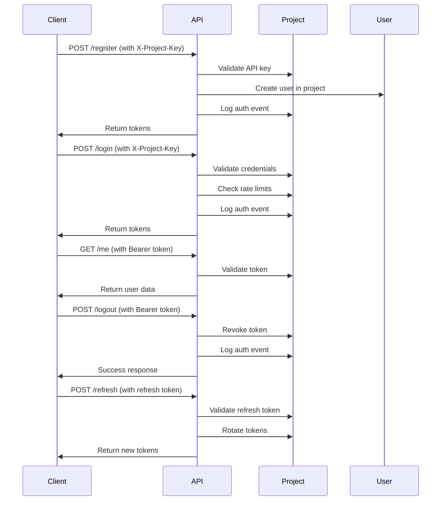

# Auth-as-a-Service: Comprehensive Project Overview

## Table of Contents

1. [Project Overview](#project-overview)
2. [Architecture](#architecture)
3. [Database Schema](#database-schema)
4. [API Documentation](#api-documentation)
5. [Admin Panel](#admin-panel)
6. [Authentication Flow](#authentication-flow)
7. [Services & Components](#services--components)
8. [Testing Strategy](#testing-strategy)
9. [Deployment](#deployment)
10. [Development Guide](#development-guide)

---

## Project Overview

**Auth-as-a-Service** is a multi-tenant authentication platform built with Laravel 13, Filament 4, and Laravel Sanctum. It provides isolated authentication systems for multiple client projects through a unified API.

### Key Features

- **Multi-tenancy**: Each project gets completely isolated authentication
- **Comprehensive Authentication**: Registration, login, logout, token refresh
- **OTP System**: Email verification, password reset, 2FA
- **Ghost Accounts**: Pre-register users for later claiming
- **Audit Logging**: Full API request and auth event tracking
- **Project Management**: Filament admin panel
- **Custom Email Templates**: Per-project email customization
- **Rate Limiting**: Project-scoped rate limiting
- **Custom SMTP**: Project-specific email configuration

### Technology Stack

- **Backend**: Laravel 13, PHP 8.5
- **Admin Panel**: Filament 4, Livewire 3
- **Authentication**: Laravel Sanctum 4
- **Testing**: Pest PHP 4, PHPUnit 12
- **Frontend**: Tailwind CSS 4, Vite
- **Database**: MySQL/PostgreSQL
- **Queue**: Redis (recommended)

---

## Architecture

### Core Concepts

```
┌─────────────────┐    ┌─────────────────┐    ┌─────────────────┐
│   Platform      │    │     Projects    │    │  Project Users  │
│   Administrators│    │  (Clients)      │    │  (End Users)    │
│                 │    │                 │    │                 │
│  • Manage       │    │  • API Key      │    │  • Belong to    │
│    projects     │    │  • Settings     │    │    projects     │
│  • View logs    │    │  • Custom       │    │  • Authenticate │
│  • Monitor usage│    │    configuration │    │  • Profile data │
└─────────────────┘    └─────────────────┘    └─────────────────┘
         │                       │                       │
         └───────────────────────┼───────────────────────┘
                                 │
                      ┌─────────────────┐
                      │   API Layer     │
                      │                 │
                      │  • Project      │
                      │    isolation    │
                      │  • Rate limiting│
                      │  • Logging      │
                      │  • Validation   │
                      └─────────────────┘
```

### Directory Structure

```
app/
├── Enums/                      # Application enums
│   ├── AuthEventType.php       # 23 auth event types
│   ├── ProjectAuthMode.php     # Authentication modes
│   ├── ProjectStatus.php       # Active/Disabled/Suspended
│   ├── ProjectLoginIdentifierMode.php
│   ├── ProjectMailMode.php     # Platform/CustomSmtp
│   ├── ProjectEmailTemplateType.php
│   └── ProjectOtpPurpose.php
├── Filament/                   # Admin panel
│   ├── Pages/
│   └── Resources/              # 7 resources
├── Http/
│   ├── Controllers/
│   │   └── Api/V1/AuthController.php
│   ├── Middleware/
│   │   ├── ResolveProjectFromApiKey.php
│   │   ├── LogProjectApiRequest.php
│   │   └── EnsureProjectAccessMatchesToken.php
│   ├── Requests/
│   │   └── Api/V1/Auth/       # 8 form requests
│   └── Resources/              # API resources
├── Jobs/                       # Queued jobs
├── Mail/                       # Mailables
├── Models/                     # 11 Eloquent models
├── Providers/
├── Services/Auth/              # 9 auth services
└── Support/
```

---

## Database Schema

### Core Tables

#### 1. `projects`

Central table for client projects.

```sql
CREATE TABLE projects (
    id CHAR(36) PRIMARY KEY,
    owner_id BIGINT UNSIGNED NOT NULL,
    name VARCHAR(255) NOT NULL,
    api_key VARCHAR(255) NOT NULL UNIQUE,
    api_secret VARCHAR(255) NOT NULL,
    status ENUM('active', 'disabled', 'suspended') DEFAULT 'active',
    created_at TIMESTAMP NULL,
    updated_at TIMESTAMP NULL,
    FOREIGN KEY (owner_id) REFERENCES users(id)
);
```

#### 2. `project_users`

End users belonging to projects.

```sql
CREATE TABLE project_users (
    id CHAR(36) PRIMARY KEY,
    project_id CHAR(36) NOT NULL,
    name VARCHAR(255) NULL,
    email VARCHAR(255) NOT NULL,
    password VARCHAR(255) NULL,
    email_verified_at TIMESTAMP NULL,
    is_ghost BOOLEAN DEFAULT FALSE,
    created_at TIMESTAMP NULL,
    updated_at TIMESTAMP NULL,
    FOREIGN KEY (project_id) REFERENCES projects(id),
    UNIQUE KEY project_users_project_id_email_unique (project_id, email)
);
```

#### 3. `project_auth_settings`

Authentication configuration per project.

```sql
CREATE TABLE project_auth_settings (
    id BIGINT UNSIGNED PRIMARY KEY AUTO_INCREMENT,
    project_id CHAR(36) NOT NULL UNIQUE,
    auth_mode ENUM('standard') DEFAULT 'standard',
    login_identifier_mode ENUM('email') DEFAULT 'email',
    allow_registration BOOLEAN DEFAULT TRUE,
    allow_ghost_accounts BOOLEAN DEFAULT FALSE,
    rate_limit_per_minute INT DEFAULT 100,
    created_at TIMESTAMP NULL,
    updated_at TIMESTAMP NULL,
    FOREIGN KEY (project_id) REFERENCES projects(id)
);
```

#### 4. `project_mail_settings`

Email configuration per project.

```sql
CREATE TABLE project_mail_settings (
    id BIGINT UNSIGNED PRIMARY KEY AUTO_INCREMENT,
    project_id CHAR(36) NOT NULL UNIQUE,
    mail_mode ENUM('platform', 'custom_smtp') DEFAULT 'platform',
    smtp_host VARCHAR(255) NULL,
    smtp_port INT NULL,
    smtp_username VARCHAR(255) NULL,
    smtp_password VARCHAR(255) NULL,
    smtp_encryption ENUM('tls', 'ssl') NULL,
    from_address VARCHAR(255) NULL,
    from_name VARCHAR(255) NULL,
    created_at TIMESTAMP NULL,
    updated_at TIMESTAMP NULL,
    FOREIGN KEY (project_id) REFERENCES projects(id)
);
```

#### 5. `project_email_templates`

Custom email templates per project.

```sql
CREATE TABLE project_email_templates (
    id BIGINT UNSIGNED PRIMARY KEY AUTO_INCREMENT,
    project_id CHAR(36) NOT NULL,
    type ENUM('otp', 'forgot_password', 'reset_password_success',
              'welcome', 'email_verification', 'ghost_account_invite') NOT NULL,
    subject VARCHAR(255) NOT NULL,
    body TEXT NOT NULL,
    created_at TIMESTAMP NULL,
    updated_at TIMESTAMP NULL,
    FOREIGN KEY (project_id) REFERENCES projects(id),
    UNIQUE KEY project_email_templates_project_id_type_unique (project_id, type)
);
```

#### 6. `project_otps`

One-time passwords for various purposes.

```sql
CREATE TABLE project_otps (
    id BIGINT UNSIGNED PRIMARY KEY AUTO_INCREMENT,
    project_id CHAR(36) NOT NULL,
    project_user_id CHAR(36) NULL,
    email VARCHAR(255) NOT NULL,
    otp VARCHAR(6) NOT NULL,
    purpose ENUM('register_verify', 'login_verify', 'forgot_password',
                 'ghost_account_claim', 'email_verification') NOT NULL,
    expires_at TIMESTAMP NOT NULL,
    verified_at TIMESTAMP NULL,
    created_at TIMESTAMP NULL,
    FOREIGN KEY (project_id) REFERENCES projects(id),
    FOREIGN KEY (project_user_id) REFERENCES project_users(id),
    INDEX project_otps_email_purpose_index (email, purpose)
);
```

#### 7. `api_request_logs`

API request audit trail.

```sql
CREATE TABLE api_request_logs (
    id BIGINT UNSIGNED PRIMARY KEY AUTO_INCREMENT,
    project_id CHAR(36) NOT NULL,
    method VARCHAR(10) NOT NULL,
    path VARCHAR(255) NOT NULL,
    status_code INT NOT NULL,
    ip_address VARCHAR(45) NULL,
    user_agent TEXT NULL,
    duration_ms INT NOT NULL,
    created_at TIMESTAMP NULL,
    FOREIGN KEY (project_id) REFERENCES projects(id),
    INDEX api_request_logs_project_id_created_at_index (project_id, created_at DESC)
);
```

#### 8. `auth_event_logs`

Authentication event tracking.

```sql
CREATE TABLE auth_event_logs (
    id BIGINT UNSIGNED PRIMARY KEY AUTO_INCREMENT,
    project_id CHAR(36) NOT NULL,
    project_user_id CHAR(36) NULL,
    event_type ENUM('user_registered', 'user_logged_in', 'user_logged_out',
                    'token_refreshed', 'password_reset_requested',
                    'password_reset_completed', 'otp_sent', 'otp_verified',
                    'email_verified', 'ghost_account_created',
                    'ghost_account_claimed', 'user_suspended',
                    'user_activated', 'login_failed', 'invalid_token',
                    'rate_limit_exceeded', 'account_locked',
                    'password_changed', 'profile_updated',
                    'email_changed', 'account_deleted',
                    'two_factor_enabled', 'two_factor_disabled') NOT NULL,
    metadata JSON NULL,
    ip_address VARCHAR(45) NULL,
    user_agent TEXT NULL,
    created_at TIMESTAMP NULL,
    FOREIGN KEY (project_id) REFERENCES projects(id),
    FOREIGN KEY (project_user_id) REFERENCES project_users(id),
    INDEX auth_event_logs_project_id_event_type_index (project_id, event_type, created_at DESC)
);
```

---

## API Documentation

### Authentication Flow



### Endpoint Summary

| Endpoint                     | Method | Description             | Auth Required |
| ---------------------------- | ------ | ----------------------- | ------------- |
| `/auth/register`             | POST   | Register new user       | No            |
| `/auth/login`                | POST   | Authenticate user       | No            |
| `/auth/me`                   | GET    | Get current user        | Yes           |
| `/auth/logout`               | POST   | Logout user             | Yes           |
| `/auth/refresh`              | POST   | Refresh access token    | No            |
| `/auth/forgot-password`      | POST   | Request password reset  | No            |
| `/auth/reset-password`       | POST   | Complete password reset | No            |
| `/auth/send-otp`             | POST   | Send OTP                | No            |
| `/auth/verify-otp`           | POST   | Verify OTP              | No            |
| `/auth/resend-otp`           | POST   | Resend OTP              | No            |
| `/auth/ghost-accounts`       | POST   | Create ghost accounts   | No            |
| `/auth/ghost-accounts/claim` | POST   | Claim ghost account     | No            |

### Rate Limiting Strategy

```php
// Project-scoped rate limiting
'throttle:project-auth' => [
    'driver' => 'project-rate-limiter',
    'max_attempts' => 10,
    'decay_minutes' => 1,
    'key' => 'project:{project_id}:ip:{ip}',
],
```

### Middleware Pipeline

```
1. ResolveProjectFromApiKey
   - Validates X-Project-Key header
   - Resolves project model
   - Sets project in request

2. LogProjectApiRequest (terminating)
   - Logs request details
   - Executes after response

3. EnsureProjectAccessMatchesToken
   - Validates token belongs to project
   - Prevents cross-project token usage

4. throttle:project-auth
   - Project-scoped rate limiting
   - Different limits per endpoint type
```

---

## Admin Panel

### Filament Resources

#### 1. Project Management (`/admin/projects`)

- List all projects
- Create/edit projects
- Generate API keys/secrets
- View project status
- Navigate to project settings

#### 2. Project Auth Settings (`/admin/projects/{id}/auth-settings`)

- Configure authentication mode
- Set registration policies
- Configure rate limits
- Enable/disable ghost accounts

#### 3. Project Mail Settings (`/admin/projects/{id}/mail-settings`)

- Choose mail mode (Platform/Custom SMTP)
- Configure SMTP settings
- Set sender details

#### 4. Project Email Templates (`/admin/projects/{id}/email-templates`)

- Customize email templates for 6 template types
- Template variables: `{{user_name}}`, `{{otp}}`, `{{reset_link}}`, etc.
- Preview templates

#### 5. Project Integration (`/admin/projects/{id}/integration`)

- View API keys
- Get integration code samples
- Test API connectivity
- View usage statistics

#### 6. Project Users (`/admin/project-users`)

- List all project users across projects
- Create/edit users
- View user status
- Filter by project

#### 7. API Request Logs (`/admin/api-request-logs`)

- View all API requests
- Filter by project, method, status code
- View request details
- Export logs

#### 8. Auth Event Logs (`/admin/auth-event-logs`)

- View authentication events
- Filter by event type, project, user
- View event metadata
- Monitor security events

### Custom Pages

- Dashboard with project statistics
- Usage analytics
- System health monitoring
- Integration guides

---

## Authentication Flow Details

### 1. User Registration

```php
// Steps in ProjectAuthService::register()
1. Validate project allows registration
2. Validate email uniqueness within project
3. Create user with hashed password
4. Generate OTP if email verification required
5. Send welcome/verification email
6. Generate access and refresh tokens
7. Log auth event
8. Return user data and tokens
```

### 2. Token System

```php
// Access Token (JWT)
- Expires in 15 minutes
- Contains: user_id, project_id, token_type, exp
- Used for authenticated requests

// Refresh Token (JWT + Database)
- Expires in 30 days
- Stored encrypted in database
- Rotated on each use (old token invalidated)
- Used to get new access token

// Token Validation
1. Verify JWT signature
2. Check token not revoked
3. Ensure token belongs to correct project
4. Validate expiration
```

### 3. OTP System

```php
// OTP Generation (ProjectOtpService)
- 6-digit numeric code
- 10-minute expiration
- Purpose-specific (register_verify, forgot_password, etc.)
- Automatic cleanup of expired OTPs

// OTP Verification
1. Find valid OTP by email and purpose
2. Check not expired
3. Verify code matches
4. Mark as verified
5. Clean up OTP record
```

### 4. Ghost Account Flow

```php
// Creating Ghost Accounts
1. Project must have ghost accounts enabled
2. Create users with is_ghost = true
3. No password set
4. Send invitation email with claim instructions

// Claiming Ghost Account
1. User receives invitation email
2. Clicks claim link (requires OTP)
3. Verifies OTP
4. Sets name and password
5. Account converted to regular user
6. User can now login normally
```

---

## Services & Components

### 1. ProjectAuthService

**Location:** `app/Services/Auth/ProjectAuthService.php`

**Responsibilities:**

- User registration and login
- Token management
- Password validation
- Account status checks

**Key Methods:**

- `register(array $data): array`
- `login(array $credentials): array`
- `logout(ProjectUser $user, string $tokenId): void`
- `refreshToken(string $refreshToken): array`

### 2. ProjectTokenService

**Location:** `app/Services/Auth/ProjectTokenService.php`

**Responsibilities:**

- Access token generation (JWT)
- Refresh token creation and rotation
- Token validation
- Token revocation

**Key Methods:**

- `createAccessToken(ProjectUser $user): string`
- `createRefreshToken(ProjectUser $user): array`
- `validateRefreshToken(string $token): ?RefreshToken`
- `revokeUserTokens(ProjectUser $user): void`

### 3. ProjectOtpService

**Location:** `app/Services/Auth/ProjectOtpService.php`

**Responsibilities:**

- OTP generation and validation
- OTP expiration management
- Purpose-specific OTP handling
- OTP cleanup

**Key Methods:**

- `generateOtp(string $email, string $purpose): ProjectOtp`
- `verifyOtp(string $email, string $otp, string $purpose): bool`
- `resendOtp(string $email, string $purpose): ProjectOtp`
- `cleanupExpiredOtps(): void`

### 4. ProjectMailService

**Location:** `app/Services/Auth/ProjectMailService.php`

**Responsibilities:**

- Email sending with project-specific settings
- Template rendering
- SMTP configuration per project
- Queue management for emails

**Key Methods:**

- `sendTemplatedEmail(Project $project, string $type, array $data): void`
- `getProjectMailer(Project $project): Mailer`
- `renderTemplate(ProjectEmailTemplate $template, array $data): array`

### 5. GhostAccountService

**Location:** `app/Services/Auth/GhostAccountService.php`

**Responsibilities:**

- Ghost account creation
- Account claiming process
- OTP integration for claiming
- Account conversion

**Key Methods:**

- `createGhostAccounts(Project $project, array $emails): array`
- `claimGhostAccount(array $data): array`
- `convertToRegularUser(ProjectUser $user, array $data): ProjectUser`

### 6. AuthEventLogger

**Location:** `app/Services/Auth/AuthEventLogger.php`

**Responsibilities:**

- Logging authentication events
- Capturing metadata (IP, user agent)
- Project and user context
- Event type classification

**Key Methods:**

- `log(string $eventType, ?Project $project, ?ProjectUser $user, array $metadata = []): void`
- `getEventDescription(string $eventType): string`
- `getEventMetadataDefaults(): array`

### 7. ProjectAuthRateLimiter

**Location:** `app/Services/Auth/ProjectAuthRateLimiter.php`

**Responsibilities:**

- Project-scoped rate limiting
- IP-based limiting
- Configurable limits per project
- Rate limit headers

**Key Methods:**

- `attempt(Project $project, string $key, int $maxAttempts, int $decayMinutes): bool`
- `remaining(Project $project, string $key, int $maxAttempts): int`
- `reset(Project $project, string $key): void`

---

## Testing Strategy

### Test Structure

```
tests/
├── Feature/
│   ├── ExampleTest.php           # Basic Laravel tests
│   ├── FilamentAdminPanelTest.php # Admin panel tests
│   ├── Phase2DataModelTest.php   # Data model tests
│   └── ProjectAuthApiTest.php    # Comprehensive API tests (851 lines)
├── Unit/
│   ├── ExampleTest.php
│   └── ProjectMailServiceTest.php # Mail service unit tests
```

### Key Test Scenarios

#### 1. Authentication API Tests (`ProjectAuthApiTest`)

```php
// Covered scenarios:
- User registration with validation
- Login with valid/invalid credentials
- Token refresh and rotation
- Password reset flow
- OTP verification
- Ghost account creation and claiming
- Rate limiting
- Project isolation
- Error handling
- Audit logging
```

#### 2. Mail Service Tests (`ProjectMailServiceTest`)

```php
// Covered scenarios:
- Template rendering with variables
- SMTP configuration switching
- Queue dispatching
- Error handling for missing templates
- Project-specific mailers
```

#### 3. Admin Panel Tests (`FilamentAdminPanelTest`)

```php
// Covered scenarios:
- Panel accessibility
- Resource listing
- Form validation
- Filter functionality
- Action execution
```

### Testing Patterns

```php
// Database setup
RefreshDatabase::class

// Queue mocking
Queue::fake()

// Authentication
$this->actingAs($user)

// Rate limiting testing
$this->withHeaders(['X-Project-Key' => $project->api_key])

// Assertions
$this->assertDatabaseHas()
$this->assertDatabaseMissing()
$this->assertJsonStructure()
$this->assertStatus()
```

### Running Tests

```bash
# Run all tests
php artisan test

# Run specific test file
php artisan test --filter=ProjectAuthApiTest

# Run with coverage
php artisan test --coverage

# Run in parallel
php artisan test --parallel
```

---

## Deployment

### Environment Configuration

#### `.env` Settings

```env
# Database
DB_CONNECTION=mysql
DB_HOST=127.0.0.1
DB_PORT=3306
DB_DATABASE=auth_service
DB_USERNAME=username
DB_PASSWORD=password

# Redis (for queues/cache)
REDIS_HOST=127.0.0.1
REDIS_PASSWORD=null
REDIS_PORT=6379

# Mail
MAIL_MAILER=smtp
MAIL_HOST=smtp.mailtrap.io
MAIL_PORT=2525
MAIL_USERNAME=username
MAIL_PASSWORD=password
MAIL_ENCRYPTION=tls
MAIL_FROM_ADDRESS="noreply@example.com"
MAIL_FROM_NAME="Auth Service"

# App
APP_NAME="Auth as a Service"
APP_ENV=production
APP_DEBUG=false
APP_URL=https://auth.example.com
APP_KEY=base64:...

# Sanctum
SANCTUM_STATEFUL_DOMAINS=auth.example.com
SESSION_DOMAIN=.auth.example.com
```

### Production Setup

#### 1. Server Requirements

```bash
# PHP 8.5+ with extensions
sudo apt install php8.5 php8.5-fpm php8.5-mysql php8.5-curl \
php8.5-gd php8.5-mbstring php8.5-xml php8.5-zip php8.5-redis

# Database (MySQL 8.0+ or PostgreSQL 13+)
sudo apt install mysql-server

# Redis
sudo apt install redis-server
```

#### 2. Nginx Configuration

```nginx
server {
    listen 80;
    server_name auth.example.com;
    root /var/www/auth-service/public;
    index index.php;

    location / {
        try_files $uri $uri/ /index.php?$query_string;
    }

    location ~ \.php$ {
        include snippets/fastcgi-php.conf;
        fastcgi_pass unix:/var/run/php/php8.5-fpm.sock;
        fastcgi_param SCRIPT_FILENAME $realpath_root$fastcgi_script_name;
        include fastcgi_params;
    }

    location ~ /\.ht {
        deny all;
    }
}
```

#### 3. Supervisor Configuration

```ini
[program:auth-service-queue]
process_name=%(program_name)s_%(process_num)02d
command=php /var/www/auth-service/artisan queue:work --sleep=3 --tries=3
autostart=true
autorestart=true
stopasgroup=true
killasgroup=true
user=www-data
numprocs=8
redirect_stderr=true
stdout_logfile=/var/www/auth-service/storage/logs/queue.log
```

#### 4. Deployment Script

```bash
#!/bin/bash
# deploy.sh

cd /var/www/auth-service

# Pull latest code
git pull origin main

# Install dependencies
composer install --no-dev --optimize-autoloader
npm install --production
npm run build

# Run migrations
php artisan migrate --force

# Clear caches
php artisan config:cache
php artisan route:cache
php artisan view:cache

# Restart services
sudo systemctl reload nginx
sudo systemctl restart php8.5-fpm
sudo supervisorctl restart all
```

### Monitoring & Logging

#### 1. Log Files

```bash
# Application logs
tail -f storage/logs/laravel.log

# Queue logs
tail -f storage/logs/queue.log

# Nginx logs
tail -f /var/log/nginx/access.log
tail -f /var/log/nginx/error.log
```

#### 2. Health Checks

```bash
# API health check
curl -H "X-Project-Key: test" https://auth.example.com/api/v1/auth/me

# Database check
php artisan db:monitor

# Queue status
php artisan queue:monitor
```

#### 3. Backup Strategy

```bash
# Database backup (daily)
mysqldump -u username -p password auth_service > backup-$(date +%Y%m%d).sql

# File backup (weekly)
tar -czf backup-$(date +%Y%m%d).tar.gz /var/www/auth-service
```

---

## Development Guide

### 1. Local Development Setup

```bash
# Clone repository
git clone https://github.com/yourusername/auth-as-a-service.git
cd auth-as-a-service

# Install dependencies
composer install
npm install

# Setup environment
cp .env.example .env
php artisan key:generate

# Configure database in .env
DB_CONNECTION=mysql
DB_HOST=127.0.0.1
DB_PORT=3306
DB_DATABASE=auth_service_dev
DB_USERNAME=root
DB_PASSWORD=

# Run migrations and seeders
php artisan migrate --seed

# Generate encryption keys
php artisan passport:keys --ansi

# Start development server
composer run dev
```

### 2. Code Standards

```bash
# Run Laravel Pint for code formatting
vendor/bin/pint

# Run static analysis (optional)
vendor/bin/phpstan analyse

# Run tests before committing
php artisan test
```

### 3. Adding New Features

#### Example: Adding Social Login

1. **Database Migration**

```php
// Add social login columns to project_users
Schema::table('project_users', function (Blueprint $table) {
    $table->string('social_provider')->nullable();
    $table->string('social_id')->nullable();
    $table->index(['social_provider', 'social_id']);
});
```

2. **Create Service**

```php
// app/Services/Auth/SocialAuthService.php
class SocialAuthService
{
    public function authenticate(string $provider, string $token): array
    {
        // Validate social token
        // Find or create user
        // Generate app tokens
    }
}
```

3. **Add API Endpoint**

```php
// routes/api.php
Route::post('/auth/social/{provider}', [AuthController::class, 'socialLogin']);

// app/Http/Controllers/Api/V1/AuthController.php
public function socialLogin(string $provider, SocialLoginRequest $request)
{
    $data = $this->socialAuthService->authenticate($provider, $request->token);
    return response()->json($data);
}
```

4. **Add Tests**

```php
// tests/Feature/SocialAuthTest.php
public function test_social_login_with_valid_token()
{
    // Test social login flow
}
```

### 4. Debugging Tips

#### Common Issues

1. **API Key Issues**

```bash
# Check project status
php artisan tinker
>>> Project::where('api_key', 'your-key')->first()->status;

# Regenerate API key
php artisan tinker
>>> $project = Project::find(1);
>>> $project->generateApiKey();
>>> $project->save();
```

2. **Email Not Sending**

```bash
# Check queue status
php artisan queue:work --once

# Test email configuration
php artisan tinker
>>> Mail::raw('Test email', fn($message) => $message->to('test@example.com'));

# View failed jobs
php artisan queue:failed
```

3. **Rate Limiting Issues**

```bash
# Check rate limit counters
php artisan tinker
>>> Cache::get('project:rate-limit:project-id:ip:127.0.0.1');

# Clear rate limits
php artisan tinker
>>> Cache::forget('project:rate-limit:*');
```

### 5. Performance Optimization

#### Database Indexing

```sql
-- Add indexes for common queries
CREATE INDEX project_users_email_index ON project_users(email);
CREATE INDEX project_otps_email_purpose_index ON project_otps(email, purpose);
CREATE INDEX api_request_logs_project_id_created_at_index ON api_request_logs(project_id, created_at DESC);
```

#### Caching Strategy

```php
// Cache project settings
Cache::remember("project:{$projectId}:auth_settings", 3600, function() use ($projectId) {
    return ProjectAuthSetting::where('project_id', $projectId)->first();
});

// Cache email templates
Cache::remember("project:{$projectId}:email_templates", 86400, function() use ($projectId) {
    return ProjectEmailTemplate::where('project_id', $projectId)->get()->keyBy('type');
});
```

#### Queue Optimization

```php
// Prioritize critical jobs
SendProjectEmailJob::dispatch($data)->onQueue('high');

// Batch similar jobs
Bus::batch([
    new SendProjectEmailJob($email1),
    new SendProjectEmailJob($email2),
    // ...
])->dispatch();
```

---

## Security Considerations

### 1. Data Protection

- **Passwords**: Hashed with bcrypt
- **API Secrets**: Encrypted at rest
- **Tokens**: JWT with HMAC signatures
- **Database**: SSL/TLS connections

### 2. Rate Limiting

- Project-scoped limits
- IP-based tracking
- Configurable thresholds
- Exponential backoff

### 3. Audit Trail

- All API requests logged
- Authentication events tracked
- IP and user agent captured
- Immutable log records

### 4. Validation

- Input validation on all endpoints
- SQL injection prevention
- XSS protection
- CSRF tokens for web forms

### 5. Regular Security Tasks

```bash
# Rotate API keys quarterly
php artisan project:rotate-keys

# Review access logs weekly
php artisan log:review --type=auth

# Update dependencies monthly
composer update
npm update

# Security scanning
composer require --dev enshrined/svg-sanitize
```

---

## Future Enhancements

### Planned Features

1. **Social Login**: OAuth2 with Google, Facebook, GitHub
2. **Webhooks**: Real-time event notifications
3. **Custom User Fields**: Dynamic user schema per project
4. **Role-Based Access Control**: Granular permissions
5. **Analytics Dashboard**: Usage insights and metrics
6. **Bulk Operations**: Import/export users
7. **Multi-Factor Authentication**: TOTP, SMS, authenticator apps
8. **Password Policy**: Configurable password rules per project
9. **Session Management**: View/revoke active sessions
10. **API Versioning**: Support multiple API versions

### Integration Examples

```javascript
// React/Next.js integration
import { AuthProvider } from "./auth-context";

function App() {
    return (
        <AuthProvider
            projectKey="your-project-key"
            apiUrl="https://auth.example.com/api/v1"
        >
            <Router />
        </AuthProvider>
    );
}

// Vue.js integration
import { createAuth } from "@auth-service/vue";

const auth = createAuth({
    projectKey: "your-project-key",
    apiUrl: "https://auth.example.com/api/v1",
});

app.use(auth);
```

---

## Support & Resources

### Documentation

- **API Docs**: `/docs/api` (Scramble documentation)
- **Admin Guide**: README.md
- **API Reference**: API.md
- **Development**: PROJECT_OVERVIEW.md

### Monitoring

- **Health Checks**: `/health` endpoint
- **Metrics**: Prometheus metrics (future)
- **Logging**: Kibana/Elasticsearch integration (future)

### Support Channels

- **GitHub Issues**: Bug reports and feature requests
- **Email**: elferjani7@gmail.com
- **Slack**: #auth-service-support

### Contributing

1. Fork the repository
2. Create feature branch
3. Write tests for new functionality
4. Submit pull request
5. Code review and merge

---

_Documentation last updated: April 6, 2026_  
_Version: 1.0.0_  
_Maintainer: Auth-as-a-Service Team_
